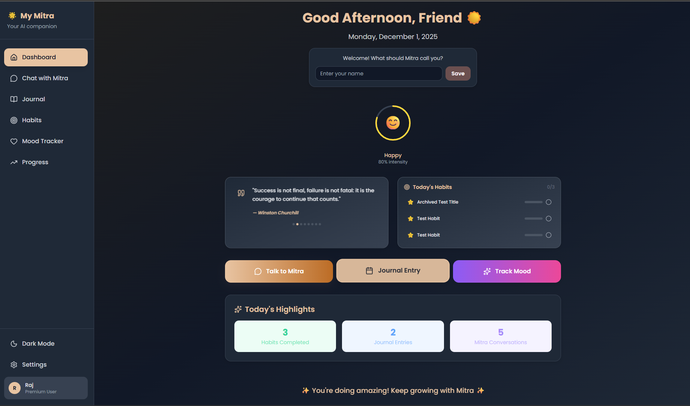
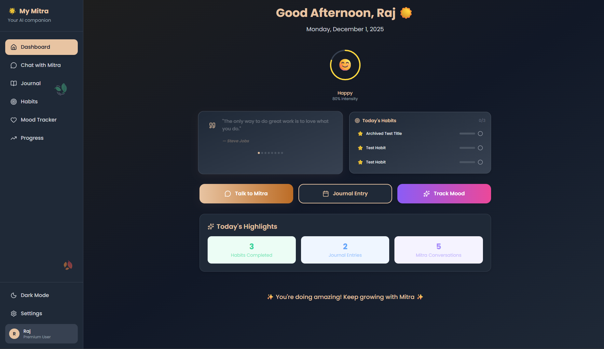
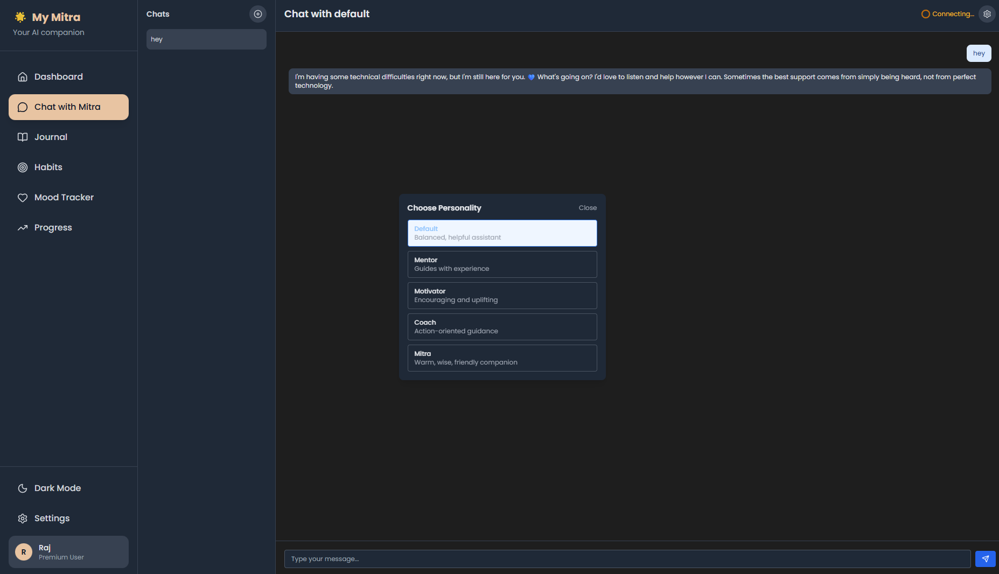
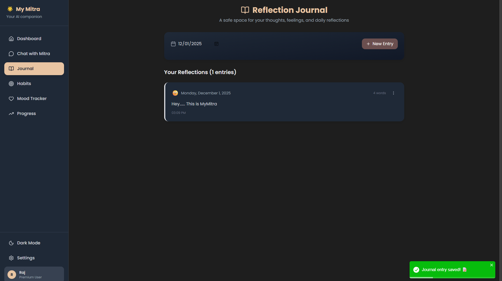
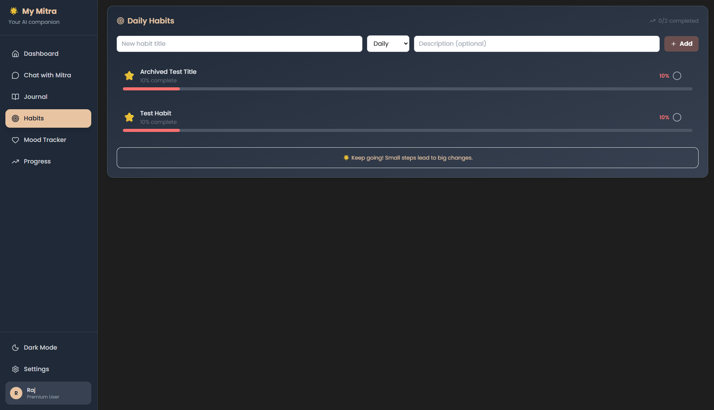
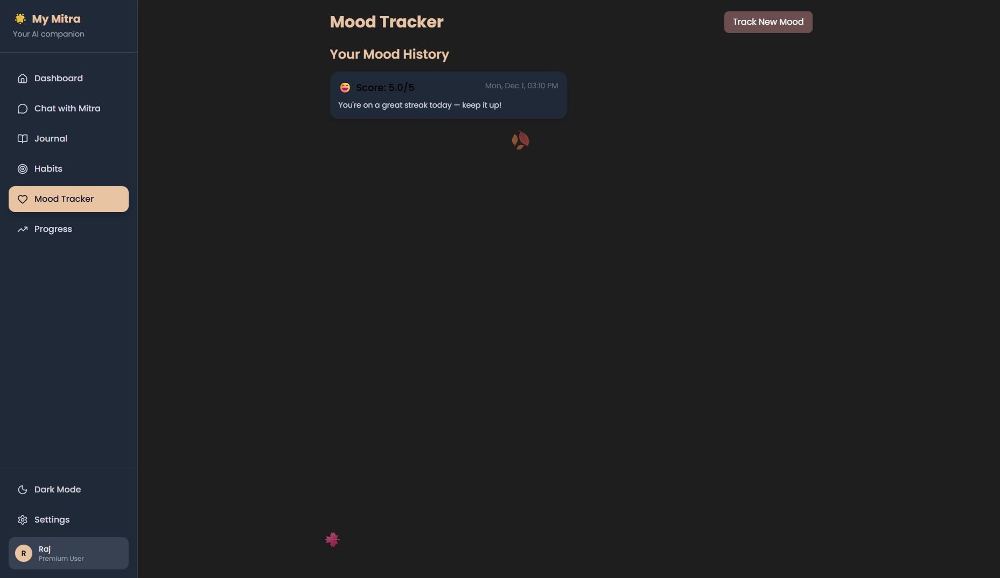

# MyMitra

MyMitra is a privacy-first emotional AI companion with multiple personalities and encrypted chat storage. It runs a FastAPI backend and a React frontend, with offline LLM support via Ollama.

## Highlights
- Privacy-first design with local encryption for sensitive data
- Multiple personalities: Mitra, Motivator, Mentor, Coach
- Personality selection modal in chat UI (Mitra by default)
- Fast-mode heuristic for short queries with depth metadata
- WebSocket-powered live chat with graceful, personality-aware fallbacks

## Screenshots

See more and contribution guidelines in `docs/screenshots/README.md`.

### Dashboard




### Chat



### Journal



### Habits



### Mood Tracking




### Progress & Insights


## Quick Start

- Clone and install:
  - `git clone https://github.com/Rajbharti06/My-Mitra`
  - Backend: `python -m venv .venv && .venv\\Scripts\\activate && pip install -r backend/requirements.txt`
  - Frontend: `cd frontend && npm install`
- Run services:
  - Backend: `uvicorn backend.app.main:app --reload --port 8000`
  - Frontend: `npm start` (served at `http://localhost:3000`)

## LLM Requirements

- Default LLM: `mistral:7b` via Ollama (configurable with `MYMITRA_OLLAMA_MODEL`).
- Ollama version: 0.3.12 or newer is recommended.
- Alternative models tested: `llama3:8b`, `gemma:7b`, `qwen2:7b` (choose based on hardware).

### Official Downloads

- Ollama (Windows/macOS/Linux): https://ollama.com/
- Models: `ollama pull mistral:7b` (or your preferred model)
- Python: https://www.python.org/downloads/
- Node.js (LTS 18+): https://nodejs.org/
- Git: https://git-scm.com/downloads

## Installation Guide

1. Install prerequisites (Windows):
   - Python 3.10+
   - Node.js 18+
   - Git
   - Ollama (ensure service is running)
2. Clone repository:
   - `git clone https://github.com/Rajbharti06/My-Mitra && cd MyMitra`
3. Backend setup:
   - `python -m venv .venv`
   - `.venv\\Scripts\\activate`
   - `pip install -r backend/requirements.txt`
   - Create `backend/.env` and set:
     - `ENCRYPTION_KEY` to a 32-character string (required)
     - `OLLAMA_BASE_URL` (default `http://localhost:11434`)
     - `MYMITRA_OLLAMA_MODEL` (optional, overrides default model)
4. Frontend setup:
   - `cd frontend && npm install`
5. Pull an LLM into Ollama:
   - `ollama pull mistral:7b`
6. Run services:
   - Backend: `uvicorn backend.app.main:app --reload --port 8000`
   - Frontend: `npm start`

## System Requirements

- Minimum hardware:
  - CPU: 4 cores
  - RAM: 8 GB
  - Disk: 5 GB free (models + DB)
- Recommended:
  - CPU: 8+ cores
  - RAM: 16 GB
  - Optional GPU for accelerated inference (via Ollama CUDA builds)
- Software:
  - Windows 10/11, macOS 12+, or modern Linux
  - Python 3.10+
  - Node.js 18+
  - Ollama 0.3.12+

### Dependency Links

- Python: https://www.python.org/downloads/
- Node.js: https://nodejs.org/en/download/
- Ollama: https://ollama.com/
- FastAPI: https://fastapi.tiangolo.com/
- Uvicorn: https://www.uvicorn.org/

## Verification Steps

1. Check versions:
   - `python --version`
   - `node --version`
   - `git --version`
   - `ollama --version`
2. Verify backend health:
   - `curl http://localhost:8000/health` → should return JSON with `status: healthy`.
3. Verify frontend:
   - Open `http://localhost:3000/` and send a message.
4. Verify LLM availability:
   - `ollama run mistral:7b` (or your model) to confirm inference.

## Performance & Caching

- A DB-backed cache for frequently asked questions is enabled by default:
  - Table: `response_cache` (encrypted at rest)
  - TTL: 7 days
  - Scope: caches general FAQs that have no personal memory/context
- Prioritization:
  - User-submitted questions take a fast path with reduced token limits and shorter timeouts to match preloaded prompt speed.
- Configuration:
  - Change model via `MYMITRA_OLLAMA_MODEL`
  - Cache TTL can be tuned in `crud.get_cached_response` (minutes)

## Backward Compatibility

- Existing API routes and request/response shapes are preserved.
- New caching and fast-mode behavior is additive; defaults match previous behavior.

## Version Control

- Repository uses semantic versioning; current backend version is `2.0.0` (see `backend/app/main.py`).
- Useful commands:
  - `git log -1 --oneline` → show current commit
  - `git status` → check local changes
  - `git tag` → list version tags (if present)

## Project Structure

```
backend/
  app/               # FastAPI app, models, routes, pipeline
  llm/               # Ollama integration and response shaping
frontend/            # React UI
```
